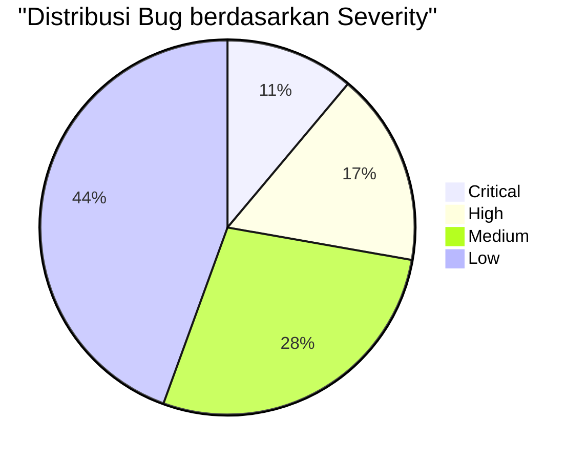
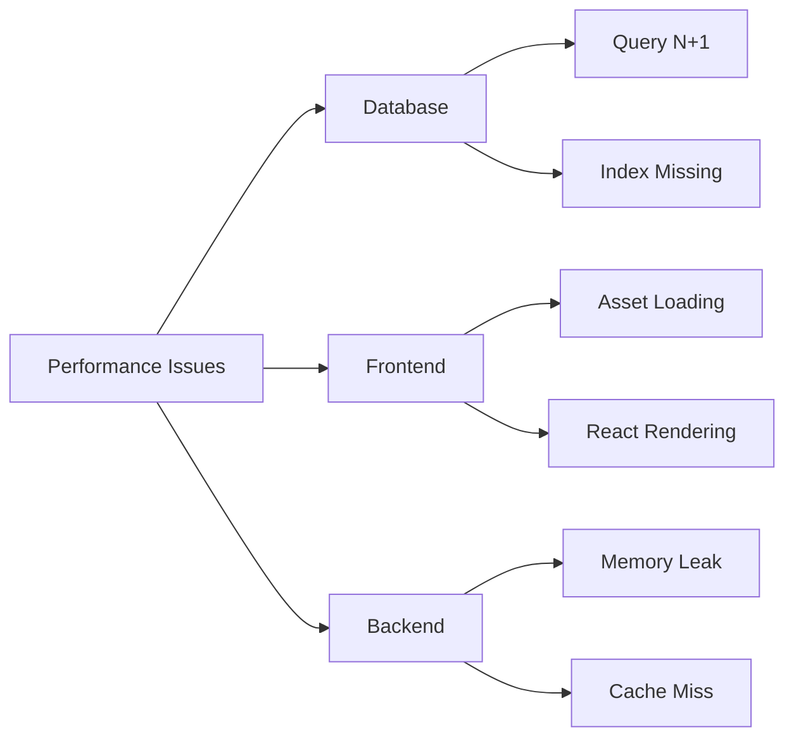
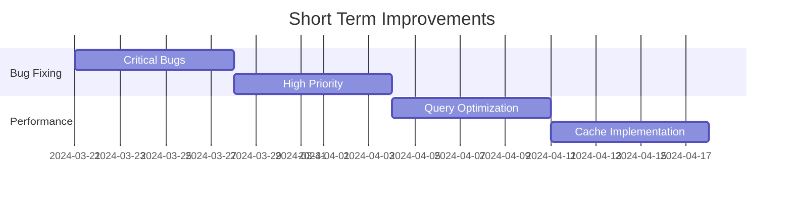
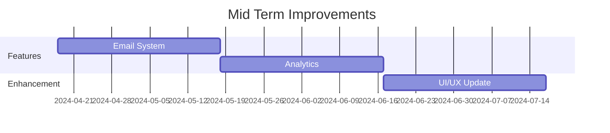
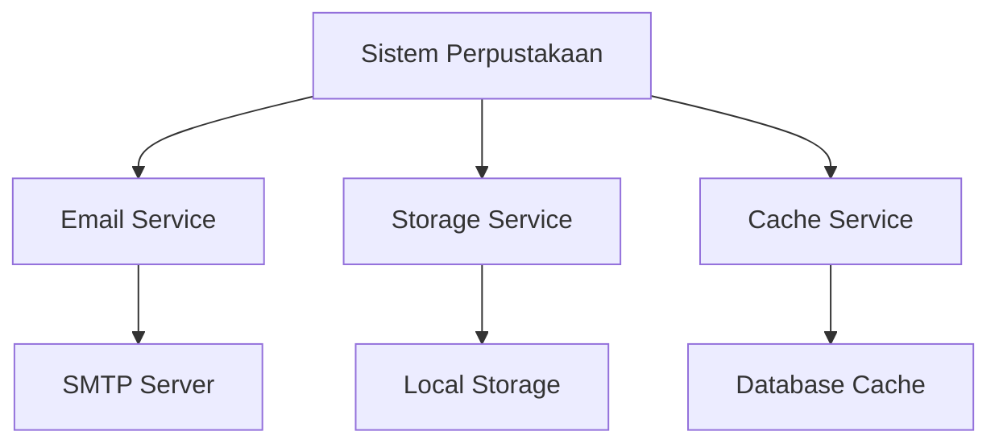
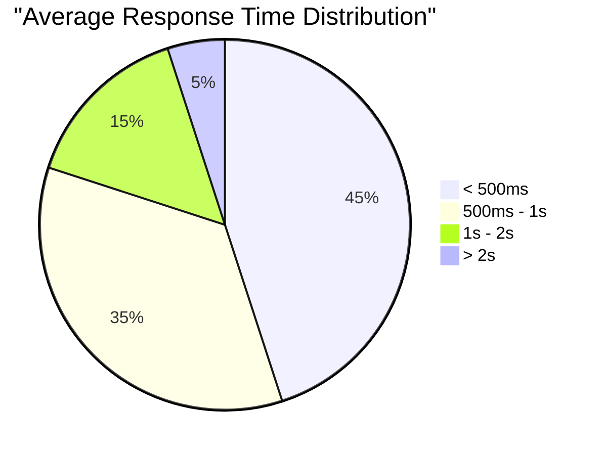

# Konteks Aktif Sistem

## Status Sistem Saat Ini

### 1. Fitur yang Sudah Berjalan

#### Manajemen Buku

-   ✓ CRUD operasi buku
-   ✓ Upload thumbnail dan file PDF
-   ✓ Pencarian buku
-   ✓ Tampilan detail buku
-   ✓ Pembacaan buku digital

#### Manajemen Member

-   ✓ Registrasi dan login
-   ✓ Role-based access control
-   ✓ Manajemen profil

#### Sistem Peminjaman

-   ✓ Pengajuan peminjaman
-   ✓ Approval system
-   ✓ Tracking status
-   ✓ Pengembalian buku

### 2. Fitur dalam Pengembangan

-   ⟳ Sistem notifikasi email
-   ⟳ Dashboard analytics
-   ⟳ Laporan bulanan
-   ⟳ Filter dan sorting yang lebih advance
-   ⟳ Integrasi dengan payment gateway

## Known Issues

### 1. Bug Terdokumentasi

#### Critical

1. Session timeout tidak konsisten
2. File PDF kadang tidak bisa diakses

#### High

1. Cache tidak ter-invalidate setelah update buku
2. Status peminjaman tidak real-time
3. Search filter tidak berfungsi dengan benar

#### Medium

1. Pagination tidak konsisten
2. Upload file besar gagal
3. Email notifikasi tertunda
4. Validasi form kurang lengkap
5. UI tidak responsif di mobile

#### Low

1. Typo di beberapa halaman
2. Icon tidak muncul
3. Loading state tidak konsisten
4. Style tidak seragam
5. Format tanggal tidak konsisten
6. Link navigasi redundan
7. Placeholder image missing
8. Console error di beberapa halaman

### 2. Performance Issues

#### Database

-   Query N+1 di list peminjaman
-   Index belum optimal
-   Connection pool belum dikonfigurasi

#### Frontend

-   Asset belum di-minify
-   Render blocking JavaScript
-   Gambar belum dioptimasi

#### Backend

-   Memory leak di file processing
-   Cache hit rate rendah
-   Session handling tidak efisien

## Planned Improvements

### 1. Short Term (1 Bulan)

#### Bug Fixing

-   Perbaikan session management
-   Fix PDF viewer issues
-   Implementasi proper cache invalidation
-   Real-time status updates

#### Performance

-   Optimasi query database
-   Implementasi caching
-   Asset optimization
-   Memory leak fixing

### 2. Mid Term (3 Bulan)

#### New Features

-   Sistem notifikasi email
-   Dashboard analytics
-   Report generator
-   Advanced search

#### Enhancements

-   UI/UX redesign
-   Mobile responsiveness
-   Performance optimization
-   Security hardening

### 3. Long Term (6 Bulan)

#### Major Features

-   Payment gateway integration
-   Mobile app development
-   AI-based book recommendations
-   Multi-language support

#### Infrastructure

-   Microservices architecture
-   Container deployment
-   CI/CD pipeline
-   Automated testing

## Integration Points

### 1. Current Integrations

### 2. Planned Integrations

-   Payment Gateway
-   SMS Gateway
-   Cloud Storage
-   Analytics Platform

## Performance Metrics

### 1. Current Performance

#### Response Time

#### Resource Usage

-   CPU: 40-60% average
-   Memory: 2GB usage
-   Disk: 70% terpakai
-   Bandwidth: 5MB/s peak

### 2. Performance Goals

-   Response time < 500ms
-   CPU usage < 50%
-   Memory usage < 2GB
-   Zero downtime deployment

## Security Status

### 1. Implemented Security

-   SSL/TLS encryption
-   Password hashing
-   Role-based access
-   Input validation
-   XSS protection
-   CSRF protection

### 2. Planned Security Updates

-   Two-factor authentication
-   API rate limiting
-   Enhanced logging
-   Security audit
-   Penetration testing

## Monitoring & Alerts

### 1. Active Monitoring

-   Server health
-   Application errors
-   Database performance
-   Cache hit rate
-   API response time

### 2. Alert Thresholds

-   Error rate > 1%
-   Response time > 2s
-   CPU usage > 80%
-   Disk space < 20%
-   Memory usage > 90%
