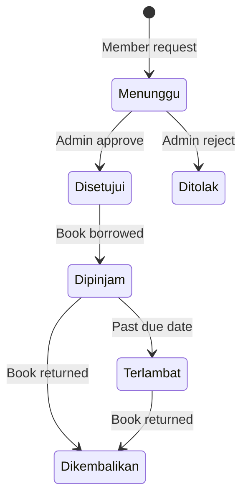

# Logika Bisnis

## Alur Peminjaman Buku

### Status Flow



### Proses Peminjaman

1. Request Peminjaman (Member)

```php
// Validasi
- Cek buku tersedia
- Cek tidak ada peminjaman aktif
- Validasi tanggal & durasi

// Create peminjaman
- Status: menunggu
- Tanggal pinjam & kembali
- User ID & Book ID
```

2. Approval (Admin)

```php
// Approve
- Update status ke 'disetujui'
- Set admin yang approve
- Notifikasi ke member

// Reject
- Update status ke 'ditolak'
- Set admin yang reject
- Set catatan penolakan
```

3. Peminjaman Aktif

```php
// Saat dipinjam
- Update status ke 'dipinjam'
- Track tanggal aktual peminjaman

// Saat terlambat
- Auto update status ke 'terlambat'
- Hitung durasi keterlambatan
```

4. Pengembalian

```php
// Return process
- Update status ke 'dikembalikan'
- Set tanggal pengembalian aktual
- Update ketersediaan buku
```

## Validasi dan Rules

### Validasi Peminjaman

```php
// Aturan peminjaman
- Maksimal durasi: 7 hari
- Tanggal pinjam minimal H+0
- Tidak boleh ada peminjaman aktif untuk buku yang sama
- Member hanya bisa lihat buku sendiri
```

### Role dan Permission

1. Admin

```php
// Permissions
- Manage books (CRUD)
- View all members
- Manage peminjaman
- Approve/reject requests
```

2. Member

```php
// Permissions
- View books
- Request peminjaman
- View own peminjaman
- Return books
```

## Notifikasi

### Event Triggers

1. Peminjaman Dibuat

```php
event(new PeminjamanCreated($peminjaman));
```

2. Status Update

```php
event(new PeminjamanStatusUpdated($peminjaman));
```

3. Due Date Reminder

```php
event(new PeminjamanDueReminder($peminjaman));
```

### Listeners

```php
protected $listen = [
    PeminjamanCreated::class => [
        SendNewPeminjamanNotification::class,
    ],
    PeminjamanStatusUpdated::class => [
        SendStatusUpdateNotification::class,
    ],
    PeminjamanDueReminder::class => [
        SendDueReminderNotification::class,
    ],
];
```

## Scheduler Tasks

### Daily Tasks

```php
// Check overdue
$schedule->command('peminjaman:check-overdue')
         ->daily();

// Send reminders
$schedule->command('peminjaman:send-reminders')
         ->dailyAt('09:00');
```

### Weekly Tasks

```php
// Clean up old records
$schedule->command('peminjaman:cleanup')
         ->weekly();

// Generate reports
$schedule->command('peminjaman:generate-report')
         ->weekly();
```

## Query Optimization

### Eager Loading

```php
// List peminjaman with relations
Peminjaman::with(['user', 'book', 'approver'])
    ->latest()
    ->paginate(10);
```

### Query Scopes

```php
// Model scopes
public function scopeActive($query)
{
    return $query->whereIn('status', ['menunggu', 'disetujui', 'dipinjam']);
}

public function scopeOverdue($query)
{
    return $query->where('status', 'dipinjam')
                 ->where('tanggal_kembali', '<', now());
}
```

## Hooks dan Observers

### Model Events

```php
protected static function booted()
{
    static::created(function ($peminjaman) {
        // Notify admin
    });

    static::updated(function ($peminjaman) {
        // Track status changes
    });
}
```

### Observers

```php
class PeminjamanObserver
{
    public function created(Peminjaman $peminjaman)
    {
        // Log creation
    }

    public function updated(Peminjaman $peminjaman)
    {
        // Check status change
        if ($peminjaman->isDirty('status')) {
            // Handle status change
        }
    }
}
```

## Exception Handling

### Custom Exceptions

```php
class PeminjamanException extends Exception
{
    public static function alreadyBorrowed()
    {
        return new static('Buku sedang dipinjam');
    }

    public static function overdue()
    {
        return new static('Peminjaman telah melewati batas waktu');
    }
}
```

### Error Responses

```php
try {
    // Process peminjaman
} catch (PeminjamanException $e) {
    return back()->with('error', $e->getMessage());
} catch (\Exception $e) {
    Log::error('Peminjaman error: ' . $e->getMessage());
    return back()->with('error', 'Terjadi kesalahan sistem');
}
```

## Response Format

### Success Response

```php
return response()->json([
    'success' => true,
    'message' => 'Peminjaman berhasil diproses',
    'data' => $peminjaman
]);
```

### Error Response

```php
return response()->json([
    'success' => false,
    'message' => 'Gagal memproses peminjaman',
    'errors' => $validator->errors()
], 422);
```

## Repository Pattern

### Peminjaman Repository

```php
class PeminjamanRepository
{
    public function create(array $data)
    {
        return DB::transaction(function () use ($data) {
            // Create peminjaman
            // Update related records
            // Trigger events
        });
    }

    public function update($id, array $data)
    {
        return DB::transaction(function () use ($id, $data) {
            // Update peminjaman
            // Handle status changes
            // Trigger events
        });
    }
}
```

### Service Layer

```php
class PeminjamanService
{
    protected $repository;

    public function processRequest($data)
    {
        // Validate request
        // Check business rules
        // Call repository
        // Handle notifications
    }

    public function processReturn($id)
    {
        // Validate return
        // Update status
        // Handle file check
    }
}
```
