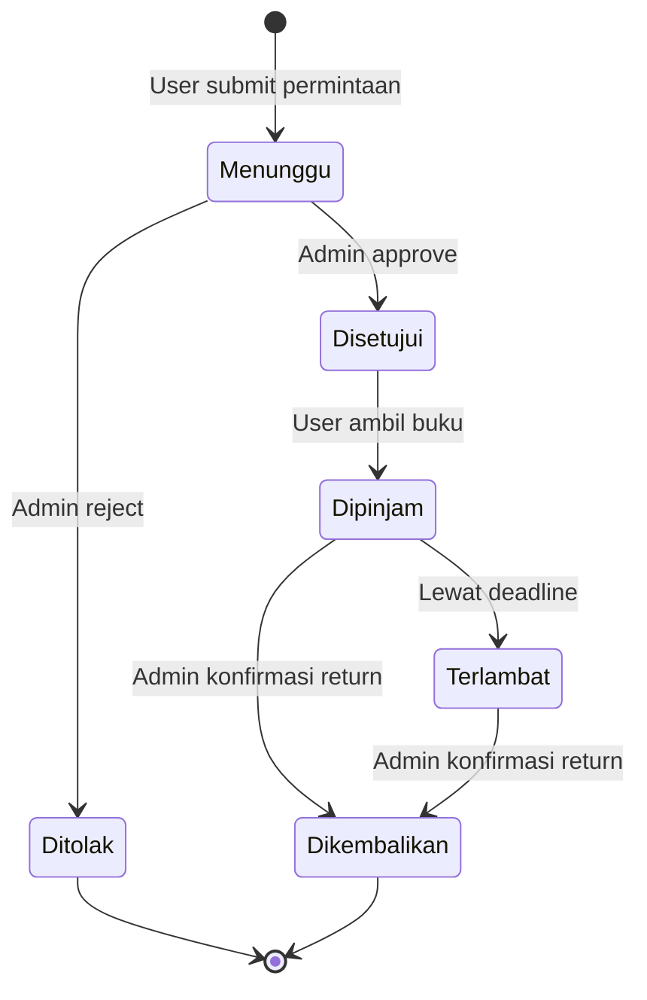

# Dokumentasi Controllers

## Struktur Controllers

Aplikasi menggunakan struktur controller yang terpisah untuk admin dan user biasa:

```
app/Http/Controllers/
├── Admin/
│   ├── BookController.php
│   ├── MemberController.php
│   └── PeminjamanController.php
├── Auth/
│   ├── LoginController.php
│   └── RegisterController.php
├── BookController.php
├── HomeController.php
├── MemberController.php
└── PeminjamanController.php
```

## Book Management

### BookController (User)

Controller untuk akses buku oleh user biasa.

#### Endpoints:

1. **read($id)**

    - Route: `GET /books/{id}/read`
    - View: `books.read`
    - Fungsi: Menampilkan detail buku untuk dibaca

2. **viewPdf($id)**
    - Route: `GET /books/{id}/pdf`
    - Fungsi: Streaming file PDF buku
    - Security:
        - Validasi existence file
        - Headers security untuk PDF viewing
        - Logging untuk tracking akses

### Admin/BookController

Controller untuk manajemen buku oleh admin.

#### Endpoints:

1. **index()**

    - Route: `GET /admin/books`
    - View: `admin.books.index`
    - Fungsi: List semua buku dengan paginasi

2. **create()**

    - Route: `GET /admin/books/create`
    - View: `admin.books.create`
    - Fungsi: Form tambah buku baru

3. **store(Request $request)**

    - Route: `POST /admin/books`
    - Validasi:
        - judul: required, max 255 chars
        - tahun_terbit: required, numeric, 1900-current
        - deskripsi: required
        - thumbnail: required, image, max 2MB
        - file: required, PDF, max 10MB
    - Storage:
        - Thumbnail: public/thumbnails/
        - PDF: public/pdfs/

4. **edit(Book $book)**

    - Route: `GET /admin/books/{book}/edit`
    - View: `admin.books.edit`
    - Fungsi: Form edit buku

5. **update(Request $request, Book $book)**

    - Route: `PUT /admin/books/{book}`
    - Validasi: sama dengan store
    - Fitur:
        - Update metadata buku
        - Optional update thumbnail & PDF
        - Hapus file lama jika ada update

6. **destroy(Book $book)**
    - Route: `DELETE /admin/books/{book}`
    - Fitur:
        - Hapus record buku
        - Hapus file terkait (thumbnail & PDF)

## Peminjaman Management

### PeminjamanController (User)

Controller untuk manajemen peminjaman oleh user.

#### Endpoints:

1. **create(Request $request, $id)**

    - Route: `GET /peminjaman/create/{id}`
    - View: `peminjaman.create`
    - Validasi: Cek peminjaman aktif

2. **store(Request $request)**

    - Route: `POST /peminjaman`
    - Validasi:
        - book_id: required, exists
        - tanggal_pinjam: required, date, >= today
        - durasi: required, 1-7 hari
    - Fungsi: Buat pengajuan peminjaman baru

3. **index()**

    - Route: `GET /peminjaman`
    - View: `peminjaman.index`
    - Fungsi: List peminjaman user

4. **show($id)**
    - Route: `GET /peminjaman/{id}`
    - View: `peminjaman.show`
    - Fungsi: Detail peminjaman

### Admin/PeminjamanController

Controller untuk approval dan manajemen peminjaman oleh admin.

#### Endpoints:

1. **index(Request $request)**

    - Route: `GET /admin/peminjaman`
    - View: `admin.peminjaman.index`
    - Fitur:
        - List semua peminjaman
        - Filter by status
        - Pagination

2. **approve($id)**

    - Route: `POST /admin/peminjaman/{id}/approve`
    - Validasi: Status harus 'menunggu'
    - Fungsi: Approve permintaan peminjaman

3. **reject($id)**

    - Route: `POST /admin/peminjaman/{id}/reject`
    - Validasi: Status harus 'menunggu'
    - Fungsi: Tolak permintaan peminjaman

4. **return($id)**
    - Route: `POST /admin/peminjaman/{id}/return`
    - Validasi: Status harus 'dipinjam'
    - Fungsi: Konfirmasi pengembalian buku

## Flow Peminjaman Buku



## Middleware

-   `CheckRole`: Validasi role user untuk akses tertentu
-   `Authenticate`: Verifikasi user login
-   `RedirectIfAuthenticated`: Redirect user yang sudah login

## Validasi & Security

1. Role-based Access Control (RBAC)
2. Form validation untuk semua input
3. File validation untuk upload
4. Secure file storage dengan public disk
5. PDF viewing security headers
6. Status validation untuk peminjaman
7. Logging untuk tracking system

## Error Handling

1. 404 untuk resource tidak ditemukan
2. Validasi status untuk transisi peminjaman
3. File existence checking
4. Peminjaman ganda prevention
5. Storage error handling
