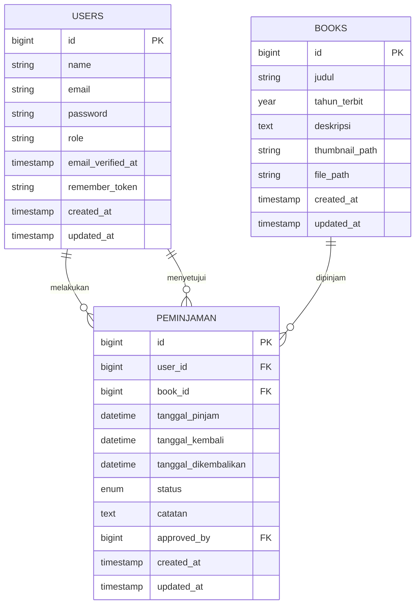

# Struktur Database Perpustakaan

## Overview Struktur Database

Sistem perpustakaan menggunakan beberapa tabel utama yang saling berelasi untuk mengelola buku, pengguna, dan peminjaman.

## Tabel dan Struktur

### 1. Users

Tabel untuk menyimpan data pengguna sistem.

```sql
CREATE TABLE users (
    id bigint PRIMARY KEY,
    name varchar(255),
    email varchar(255) UNIQUE,
    password varchar(255),
    role varchar(255) DEFAULT 'member',
    email_verified_at timestamp NULL,
    remember_token varchar(100) NULL,
    created_at timestamp NULL,
    updated_at timestamp NULL
);
```

**Role System:**

-   `member`: Pengguna biasa yang dapat meminjam buku
-   `admin`: Administrator yang dapat mengelola sistem

### 2. Books

Tabel untuk menyimpan informasi buku.

```sql
CREATE TABLE books (
    id bigint PRIMARY KEY,
    judul varchar(255),
    tahun_terbit year,
    deskripsi text,
    thumbnail_path varchar(255) NULL,
    file_path varchar(255) NULL,
    created_at timestamp NULL,
    updated_at timestamp NULL
);
```

**Fitur File:**

-   `thumbnail_path`: Path untuk gambar cover buku
-   `file_path`: Path untuk file PDF buku (opsional)

### 3. Peminjaman

Tabel untuk mencatat transaksi peminjaman buku.

```sql
CREATE TABLE peminjaman (
    id bigint PRIMARY KEY,
    user_id bigint FOREIGN KEY REFERENCES users(id),
    book_id bigint FOREIGN KEY REFERENCES books(id),
    tanggal_pinjam datetime,
    tanggal_kembali datetime,
    tanggal_dikembalikan datetime NULL,
    status enum('menunggu','disetujui','dipinjam','dikembalikan','terlambat','ditolak'),
    catatan text NULL,
    approved_by bigint NULL FOREIGN KEY REFERENCES users(id),
    created_at timestamp NULL,
    updated_at timestamp NULL
);
```

**Status Peminjaman:**

-   `menunggu`: Permintaan peminjaman baru
-   `disetujui`: Peminjaman disetujui admin
-   `dipinjam`: Buku sedang dipinjam
-   `dikembalikan`: Buku sudah dikembalikan
-   `terlambat`: Peminjaman melewati batas waktu
-   `ditolak`: Permintaan peminjaman ditolak

## Model dan Relasi

### User Model

```php
class User extends Authenticatable
{
    use HasFactory, Notifiable;

    protected $fillable = [
        'name',
        'email',
        'password',
    ];

    protected $hidden = [
        'password',
        'remember_token',
    ];

    protected $casts = [
        'email_verified_at' => 'datetime',
        'password' => 'hashed',
    ];
}
```

### Book Model

```php
class Book extends Model
{
    use HasFactory;

    protected $fillable = [
        'judul',
        'tahun_terbit',
        'deskripsi',
        'thumbnail_path',
        'file_path',
    ];

    // Accessor untuk URL thumbnail
    public function getThumbnailUrlAttribute()
    {
        return $this->thumbnail_path ? asset('storage/' . $this->thumbnail_path) : null;
    }

    // Accessor untuk URL file PDF
    public function getPdfUrlAttribute()
    {
        return $this->file_path ? asset('storage/' . $this->file_path) : null;
    }
}
```

### Peminjaman Model

```php
class Peminjaman extends Model
{
    use HasFactory;

    protected $table = 'peminjaman';

    protected $fillable = [
        'user_id',
        'book_id',
        'tanggal_pinjam',
        'tanggal_kembali',
        'tanggal_dikembalikan',
        'status',
        'catatan',
        'approved_by'
    ];

    protected $casts = [
        'tanggal_pinjam' => 'datetime',
        'tanggal_kembali' => 'datetime',
        'tanggal_dikembalikan' => 'datetime',
    ];

    // Relasi ke peminjam
    public function user()
    {
        return $this->belongsTo(User::class);
    }

    // Relasi ke buku
    public function book()
    {
        return $this->belongsTo(Book::class);
    }

    // Relasi ke admin yang menyetujui
    public function approver()
    {
        return $this->belongsTo(User::class, 'approved_by');
    }

    // Cek status keterlambatan
    public function isOverdue()
    {
        return $this->status === 'dipinjam' && now() > $this->tanggal_kembali;
    }
}
```

## Diagram Relasi



## Catatan Tambahan

-   Sistem menggunakan soft deletes untuk data sensitif
-   File storage menggunakan local disk dengan symlink ke public
-   Relationship constraints menggunakan cascade delete
-   Timestamps digunakan di semua tabel untuk audit trail
