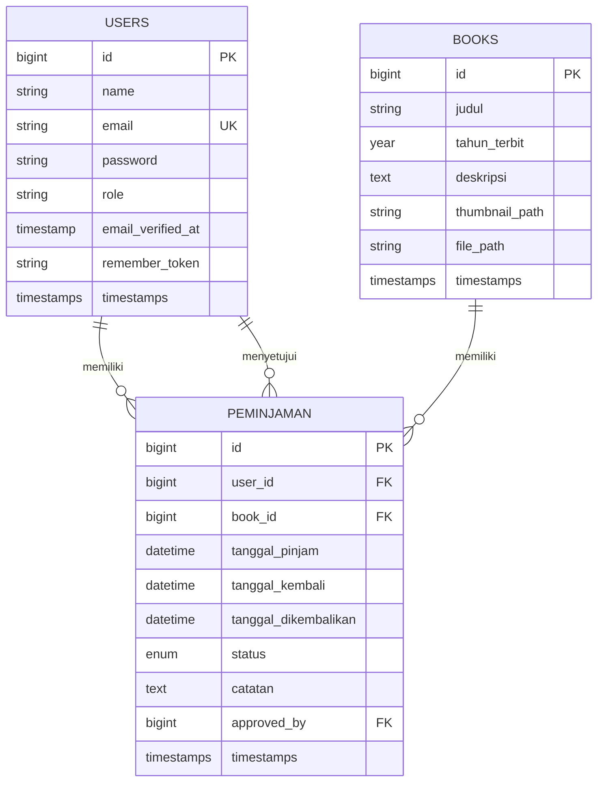

# Struktur Database

## Diagram Entity Relationship (ERD)

## Detail Tabel

### Tabel Users

Menyimpan data pengguna sistem (admin dan member).

| Kolom             | Tipe      | Deskripsi                    |
| ----------------- | --------- | ---------------------------- |
| id                | bigint    | Primary key                  |
| name              | string    | Nama pengguna                |
| email             | string    | Email (unique)               |
| password          | string    | Password (hashed)            |
| role              | string    | Role pengguna (admin/member) |
| email_verified_at | timestamp | Waktu verifikasi email       |
| remember_token    | string    | Token untuk "remember me"    |
| created_at        | timestamp | Waktu pembuatan record       |
| updated_at        | timestamp | Waktu update terakhir        |

### Tabel Books

Menyimpan data buku perpustakaan.

| Kolom          | Tipe      | Deskripsi              |
| -------------- | --------- | ---------------------- |
| id             | bigint    | Primary key            |
| judul          | string    | Judul buku             |
| tahun_terbit   | year      | Tahun terbit buku      |
| deskripsi      | text      | Deskripsi buku         |
| thumbnail_path | string    | Path thumbnail buku    |
| file_path      | string    | Path file PDF buku     |
| created_at     | timestamp | Waktu pembuatan record |
| updated_at     | timestamp | Waktu update terakhir  |

### Tabel Peminjaman

Menyimpan data transaksi peminjaman buku.

| Kolom                | Tipe      | Deskripsi                    |
| -------------------- | --------- | ---------------------------- |
| id                   | bigint    | Primary key                  |
| user_id              | bigint    | FK ke tabel users (peminjam) |
| book_id              | bigint    | FK ke tabel books            |
| tanggal_pinjam       | datetime  | Tanggal peminjaman           |
| tanggal_kembali      | datetime  | Tanggal batas pengembalian   |
| tanggal_dikembalikan | datetime  | Tanggal aktual pengembalian  |
| status               | enum      | Status peminjaman            |
| catatan              | text      | Catatan peminjaman           |
| approved_by          | bigint    | FK ke tabel users (admin)    |
| created_at           | timestamp | Waktu pembuatan record       |
| updated_at           | timestamp | Waktu update terakhir        |

### Status Peminjaman

Nilai yang mungkin untuk kolom `status` pada tabel `peminjaman`:

-   `menunggu` - Menunggu persetujuan admin
-   `disetujui` - Peminjaman disetujui
-   `dipinjam` - Buku sedang dipinjam
-   `dikembalikan` - Buku sudah dikembalikan
-   `terlambat` - Melewati batas waktu
-   `ditolak` - Peminjaman ditolak

## Foreign Keys & Constraints

### Tabel Peminjaman

-   `user_id` references `users(id)` on delete cascade
-   `book_id` references `books(id)` on delete cascade
-   `approved_by` references `users(id)` nullable

### Indexes

-   `users.email` - Unique index
-   `peminjaman.user_id` - Index untuk relasi
-   `peminjaman.book_id` - Index untuk relasi
-   `peminjaman.approved_by` - Index untuk relasi

## Migrasi Database

Urutan migrasi:

1. create_users_table
2. create_books_table
3. create_peminjaman_table
4. add_role_to_users_table
5. update_peminjaman_status_enum
6. add_timestamps_to_peminjaman_table
