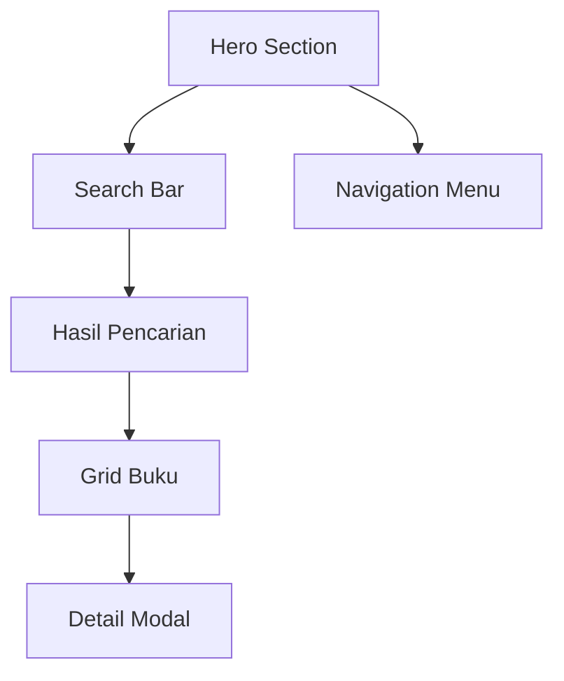
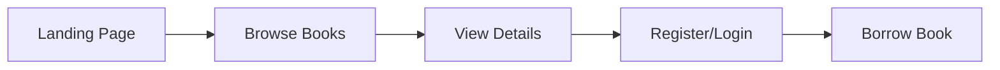
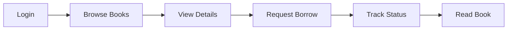
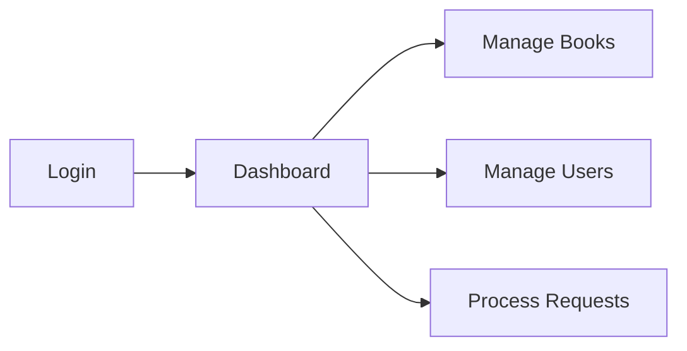

# Konteks Produk Perpustakaan Digital

## Overview Produk

Perpustakaan Digital adalah platform modern untuk manajemen dan akses buku digital yang memungkinkan pengguna untuk mencari, membaca, dan meminjam buku secara online. Sistem ini dirancang untuk memudahkan akses ke pengetahuan sambil mempertahankan kontrol dan tracking yang baik atas penggunaan sumber daya perpustakaan.

## User Interface

### 1. Landing Page

#### Komponen UI

-   **Hero Section**

    -   Gradient background animasi
    -   Headline "Jelajahi Dunia Pengetahuan"
    -   Search bar dengan efek glass-morphism
    -   Floating decorative elements

-   **Navigation**

    -   Logo/Brand
    -   Login/Register untuk guest
    -   Dashboard akses untuk user
    -   Logout untuk user aktif

-   **Book Grid**
    -   Responsive grid layout (1-4 kolom)
    -   Card dengan hover effects
    -   Thumbnail buku dengan fallback
    -   Informasi dasar (judul, tahun, deskripsi)

### 2. Fitur Visual

-   Animasi gradient background
-   Hover effects pada cards
-   Glass-morphism effects
-   Floating animations
-   Responsive design
-   Modal windows untuk detail
-   Image thumbnails dengan fallback

## User Journey

### 1. Guest User Flow

### 2. Member Flow

### 3. Admin Flow

## Fitur Utama

### 1. Pencarian & Katalog

-   Search bar responsif
-   Filter berdasarkan judul dan deskripsi
-   Grid view dengan pagination
-   Preview thumbnail dan deskripsi
-   Modal detail buku

### 2. Manajemen Buku

-   Upload buku digital (PDF)
-   Upload thumbnail
-   Metadata management
-   File preview system
-   Secure file storage

### 3. Sistem Peminjaman

-   Request peminjaman
-   Approval workflow
-   Status tracking
-   Durasi peminjaman
-   Pengembalian otomatis

### 4. User Management

-   Role-based access
-   Member registration
-   Profile management
-   Activity history
-   Admin dashboard

## User Experience Design

### 1. Visual Hierarchy

-   Clean, modern interface
-   Clear call-to-actions
-   Visual feedback pada interaksi
-   Consistent branding elements
-   Responsive layouts

### 2. Navigation Pattern

-   Intuitive menu structure
-   Breadcrumb navigation
-   Modal-based detail views
-   Dashboard organization
-   Clear status indicators

### 3. Feedback System

-   Success/error messages
-   Status updates
-   Loading indicators
-   Confirmation dialogs
-   Form validation

## Content Strategy

### 1. Buku Digital

-   Thumbnail visual
-   Metadata terstruktur
-   Preview konten
-   Download controls
-   Access restrictions

### 2. User Generated Content

-   Peminjaman requests
-   Status updates
-   Activity logs
-   User profiles
-   Admin notes

## Performance Considerations

### 1. Loading Optimization

-   Lazy loading images
-   Pagination implementasi
-   Modal-based detail loading
-   Efficient search queries
-   Caching strategies

### 2. User Experience

-   Smooth animations
-   Responsive interactions
-   Quick search results
-   Fast page loads
-   Minimal loading states

## Security Features

### 1. Access Control

-   Role-based permissions
-   Session management
-   Secure file access
-   Protected routes
-   Rate limiting

### 2. Data Protection

-   Secure file storage
-   Encrypted connections
-   Protected user data
-   Safe file handling
-   Audit logging

## Monitoring & Analytics

### 1. User Behavior

-   Popular books
-   Search patterns
-   Usage statistics
-   User engagement
-   Peak usage times

### 2. System Health

-   Error tracking
-   Performance metrics
-   Resource usage
-   Security events
-   API reliability

## Future Enhancements

### 1. Planned Features

-   Rating system
-   User reviews
-   Mobile app
-   Advanced search
-   Recommendation engine

### 2. Potential Improvements

-   Multi-language support
-   Social features
-   Reading progress tracking
-   Notification system
-   Integration dengan e-reader
