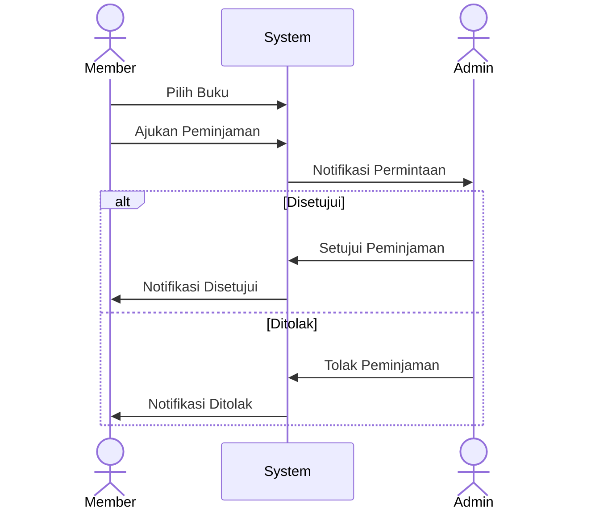
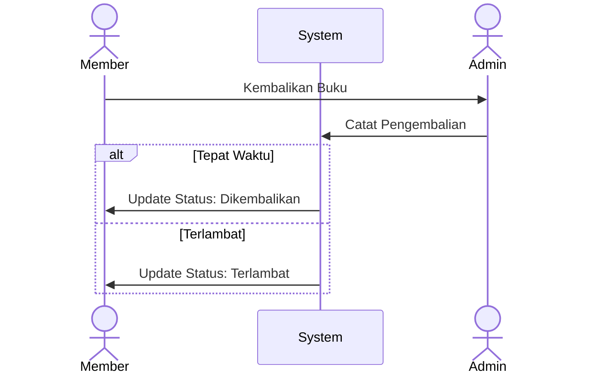
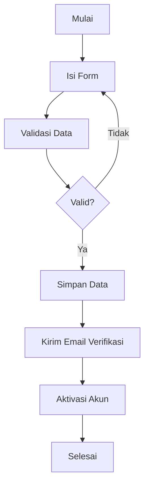
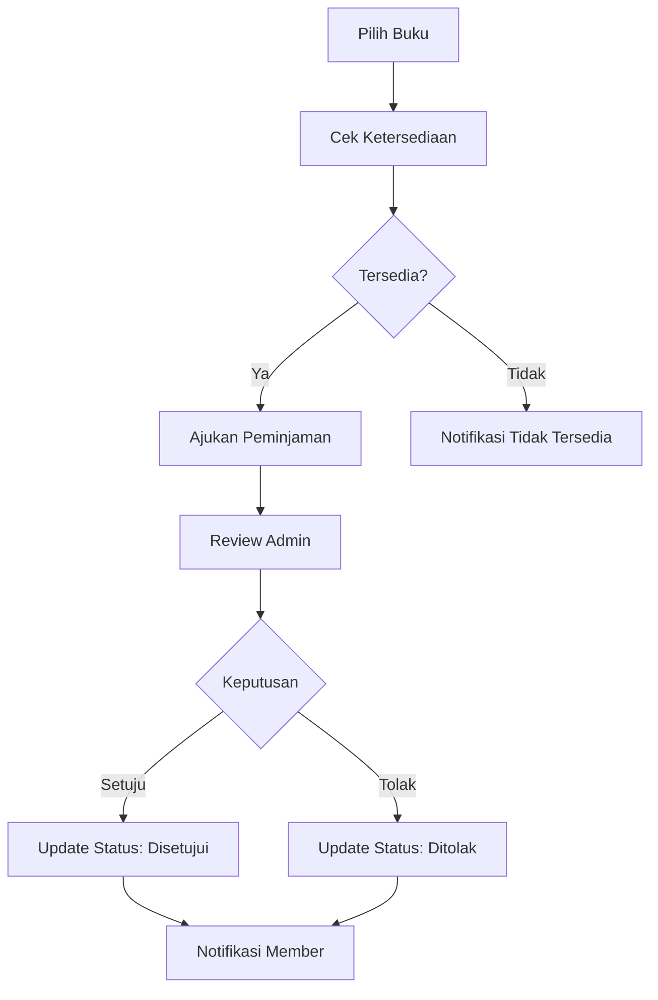

# Konteks Produk Sistem Perpustakaan

## User Stories

### 1. Sebagai Pengunjung

-   Saya ingin melihat daftar buku yang tersedia
-   Saya ingin mencari buku berdasarkan judul
-   Saya ingin mendaftar sebagai anggota
-   Saya ingin melihat detail buku tertentu

### 2. Sebagai Member

-   Saya ingin login ke sistem
-   Saya ingin meminjam buku
-   Saya ingin melihat status peminjaman saya
-   Saya ingin membaca buku digital
-   Saya ingin melihat riwayat peminjaman saya
-   Saya ingin mengetahui kapan harus mengembalikan buku

### 3. Sebagai Admin

-   Saya ingin mengelola data buku (CRUD)
-   Saya ingin menyetujui/menolak permintaan peminjaman
-   Saya ingin mencatat pengembalian buku
-   Saya ingin melihat laporan peminjaman
-   Saya ingin mengelola data anggota
-   Saya ingin melihat buku yang terlambat dikembalikan

## Use Cases

### 1. Peminjaman Buku

### 2. Pengembalian Buku

## Business Rules

### 1. Peminjaman

-   Maksimal 3 buku aktif per member
-   Durasi peminjaman: 1-7 hari
-   Harus disetujui admin
-   Status peminjaman harus jelas
-   Tidak boleh ada peminjaman ganda

### 2. Keanggotaan

-   Email harus unik
-   Password minimal 8 karakter
-   Role: admin atau member
-   Verifikasi email untuk aktivasi

### 3. Pengelolaan Buku

-   Thumbnail wajib ada
-   File PDF opsional
-   Tahun terbit tidak boleh lebih dari tahun sekarang
-   Deskripsi wajib ada

## Workflow Processes

### 1. Registrasi Member

### 2. Proses Peminjaman

## Access Control Matrix

### Role: Member

| Resource           | Create | Read | Update | Delete |
| ------------------ | ------ | ---- | ------ | ------ |
| Profile Sendiri    | -      | ✓    | ✓      | -      |
| Daftar Buku        | -      | ✓    | -      | -      |
| File Buku          | -      | ✓    | -      | -      |
| Peminjaman Sendiri | ✓      | ✓    | -      | -      |
| Riwayat Peminjaman | -      | ✓    | -      | -      |

### Role: Admin

| Resource   | Create | Read | Update | Delete |
| ---------- | ------ | ---- | ------ | ------ |
| Buku       | ✓      | ✓    | ✓      | ✓      |
| Member     | ✓      | ✓    | ✓      | ✓      |
| Peminjaman | -      | ✓    | ✓      | -      |
| Laporan    | -      | ✓    | -      | -      |

## Notifikasi

### 1. Email Notifikasi

-   Verifikasi pendaftaran
-   Persetujuan peminjaman
-   Penolakan peminjaman
-   Pengingat pengembalian
-   Notifikasi keterlambatan

### 2. System Notifikasi

-   Status peminjaman berubah
-   Buku baru ditambahkan
-   Akun dinonaktifkan
-   Password direset

## Performance Requirements

### 1. Response Time

-   Halaman load < 2 detik
-   Pencarian < 1 detik
-   Upload file < 5 detik
-   Download file < 3 detik

### 2. Concurrent Users

-   Minimal 100 user simultan
-   Optimal 50 request/detik

## Data Retention

### 1. Log Data

-   Activity log: 30 hari
-   Error log: 14 hari
-   Access log: 7 hari

### 2. Backup

-   Database: daily backup
-   File storage: weekly backup
-   Retention period: 90 hari

## Business Metrics

### 1. Usage Metrics

-   Jumlah peminjaman per hari
-   Rata-rata durasi peminjaman
-   Buku paling populer
-   Peak usage hours

### 2. Performance Metrics

-   Response time
-   Error rate
-   Availability
-   User satisfaction

## Support & Maintenance

### 1. Technical Support

-   Email support
-   Bug reporting
-   Feature request
-   Documentation

### 2. Maintenance Window

-   Weekly maintenance
-   Scheduled upgrades
-   Emergency patching
-   Version control
