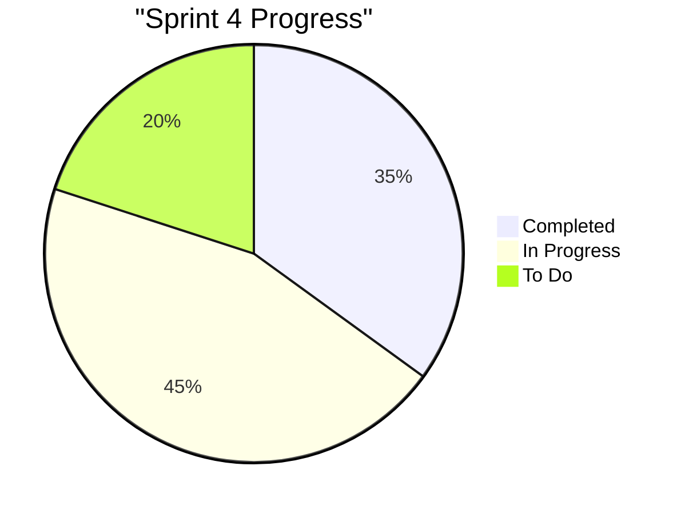
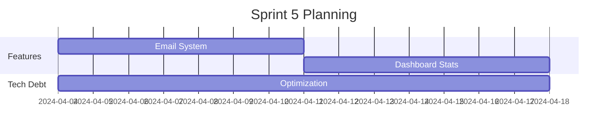
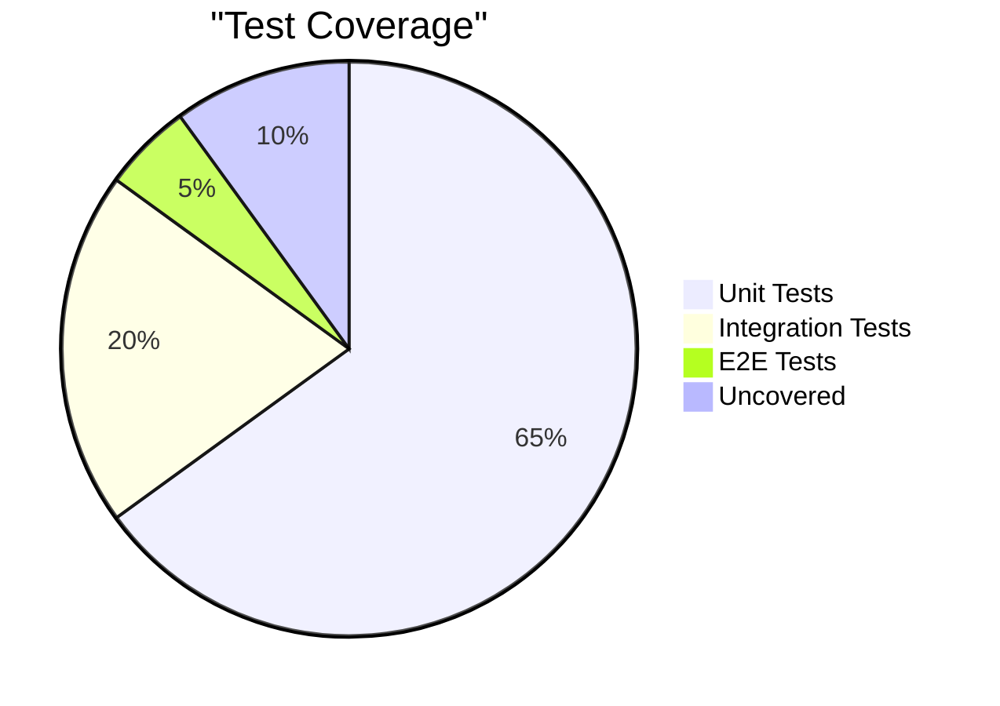
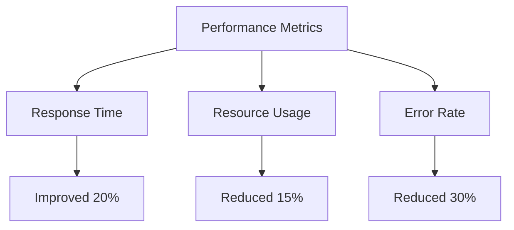
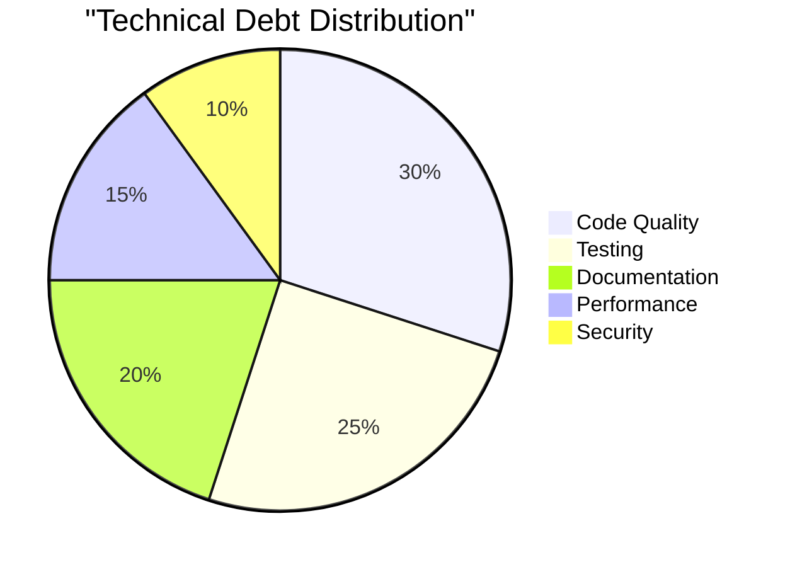

# Progress & Development Tracking

## Sprint Saat Ini (Sprint 4)

### Periode

20 Maret 2025 - 3 April 2025

### Status Progress

### User Stories dalam Pengerjaan

#### High Priority

1. ⏳ Implementasi notifikasi email untuk peminjaman
    - Setup SMTP server
    - Template email
    - Queue system untuk pengiriman
2. ⏳ Perbaikan bug PDF viewer
    - Investigasi masalah akses file
    - Implementasi streaming yang lebih baik
    - Testing di berbagai browser

#### Medium Priority

1. ⏳ Optimasi database query

    - Analisis query yang lambat
    - Implementasi indexing
    - Cache layer

2. ⏳ UI/UX improvements
    - Mobile responsiveness
    - Loading states
    - Error handling

#### Low Priority

1. ⏳ Documentation updates
    - API documentation
    - User guide
    - Development setup guide

## Sprint Sebelumnya

### Sprint 3 (6-19 Maret 2025)

#### Completed

-   ✓ Sistem approval peminjaman
-   ✓ CRUD operations untuk buku
-   ✓ User authentication
-   ✓ File upload system
-   ✓ Basic search functionality

#### Carried Over

-   ⟳ Email notification system
-   ⟳ PDF viewer improvements
-   ⟳ Database optimization

### Sprint 2 (20 Feb - 5 Mar 2025)

#### Completed

-   ✓ Database migrations
-   ✓ Basic MVC structure
-   ✓ Role-based access control
-   ✓ Initial UI templates

#### Technical Debt Resolved

-   ✓ Proper error handling
-   ✓ Code documentation
-   ✓ Test coverage improvement

### Sprint 1 (6-19 Feb 2025)

#### Completed

-   ✓ Project setup
-   ✓ Environment configuration
-   ✓ Basic routing
-   ✓ Authentication scaffold

## Upcoming Work

### Sprint 5 (Planned)

#### Features Planned

1. 📅 Complete email notification system
2. 📅 Admin dashboard with statistics
3. 📅 Advanced search filters
4. 📅 Reporting system

#### Technical Improvements

1. 📅 Performance optimization
2. 📅 Security enhancements
3. 📅 Code refactoring
4. 📅 Test coverage increase

## Development Metrics

### Code Quality

### Performance Trends

## Recent Changes

### 1. Features Added

#### Week 11-17 Maret

-   ✓ PDF viewer integration
-   ✓ Book thumbnail upload
-   ✓ Member registration flow
-   ✓ Basic search functionality

#### Week 4-10 Maret

-   ✓ Authentication system
-   ✓ Role management
-   ✓ Database structure
-   ✓ Basic CRUD operations

### 2. Bug Fixes

#### Critical

-   ✓ User session handling
-   ✓ File permission issues
-   ✓ Database connection pooling

#### High

-   ✓ Form validation
-   ✓ Error message display
-   ✓ Date format consistency

## Technical Debt

### Current Status

### Priority Items

#### Immediate Action Needed

1. 🔥 Query optimization
2. 🔥 Cache implementation
3. 🔥 Error handling improvement

#### Next Sprint

1. 📅 Code refactoring
2. 📅 Test coverage
3. 📅 Documentation update

## Deployment History

### Latest Production Release

-   Version: 1.0.0
-   Date: 17 Maret 2025
-   Status: Stable

### Recent Deployments

#### v1.0.0 (17 Maret 2025)

-   ✓ Initial production release
-   ✓ Core features implemented
-   ✓ Basic functionality stable

#### v0.9.0 (10 Maret 2025)

-   ✓ Beta testing phase
-   ✓ User acceptance testing
-   ✓ Performance optimization

#### v0.8.0 (3 Maret 2025)

-   ✓ Alpha testing phase
-   ✓ Feature completion
-   ✓ Initial testing

## Notes & Observations

### 1. Lesson Learned

-   Early performance testing crucial
-   Need better error handling
-   Mobile-first approach beneficial
-   Regular security audits important

### 2. Best Practices Implemented

-   Code review process
-   Automated testing
-   Documentation standards
-   Git workflow

### 3. Areas for Improvement

-   Test coverage
-   Mobile responsiveness
-   Error handling
-   Performance optimization

## Next Actions

### Immediate (24 Jam)

-   📌 Fix critical PDF viewer bug
-   📌 Deploy email notification system
-   📌 Update production database indexes

### Short Term (1 Minggu)

-   📅 Complete sprint 4 user stories
-   📅 Prepare sprint 5 planning
-   📅 Technical debt reduction

### Medium Term (1 Bulan)

-   📅 Feature completion
-   📅 Performance optimization
-   📅 Security enhancements
