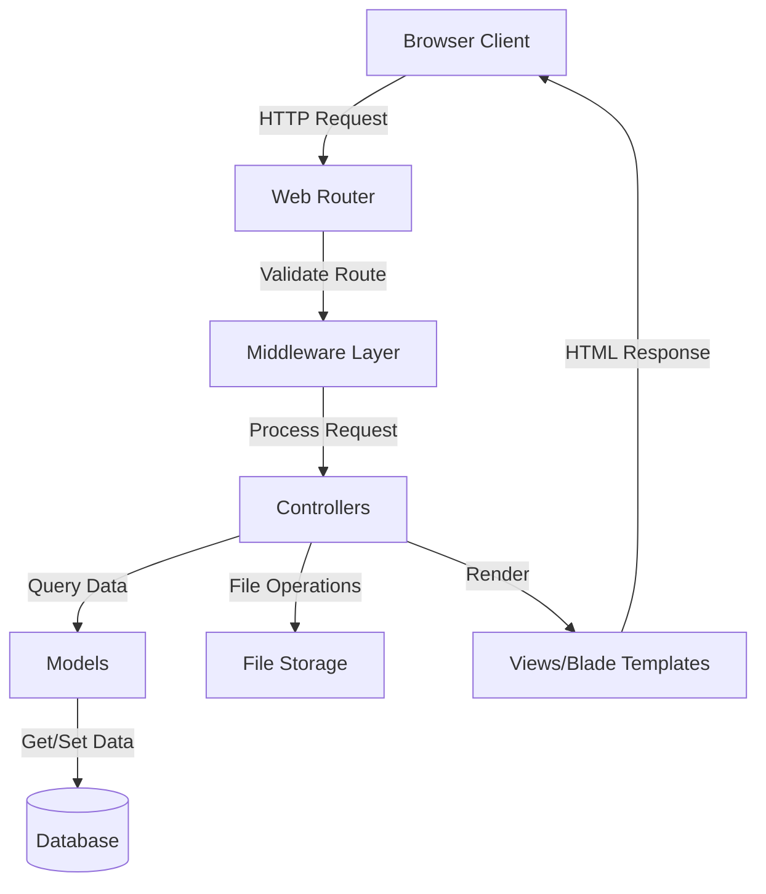
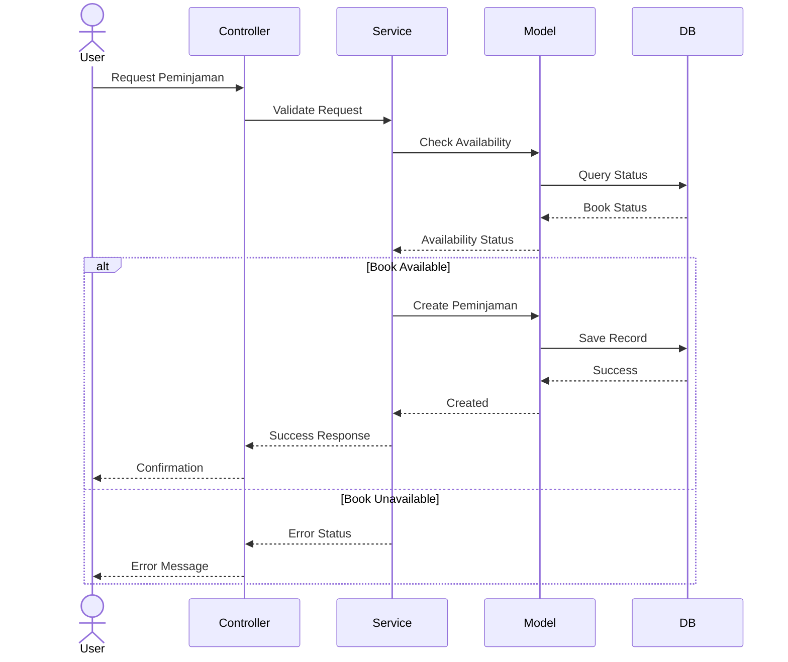
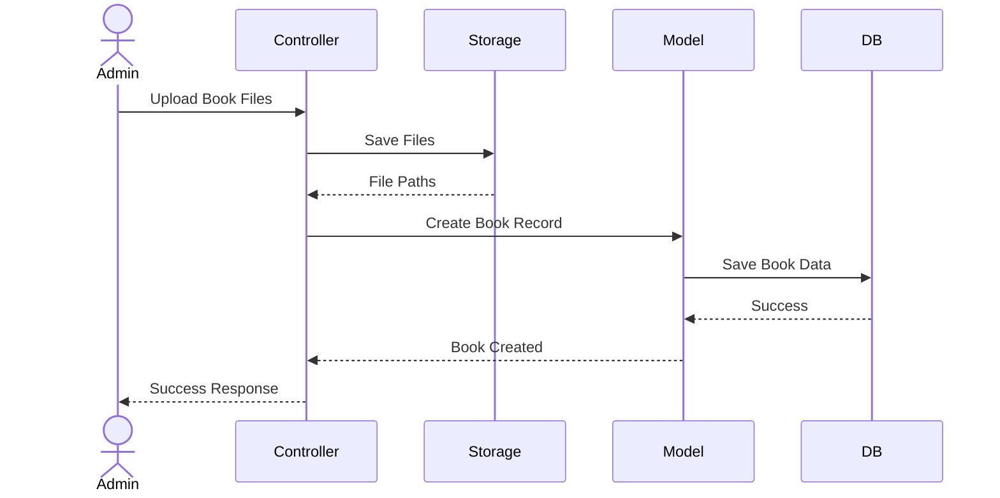
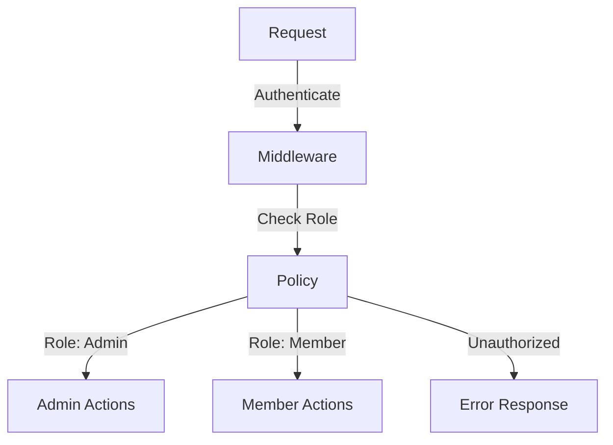
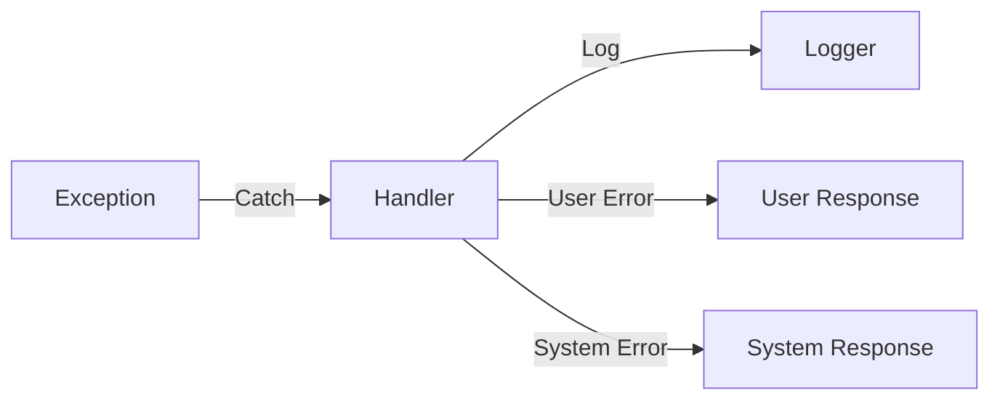

# System Patterns & Architecture

## Arsitektur Sistem

Sistem perpustakaan menggunakan arsitektur MVC (Model-View-Controller) dengan Laravel framework.



## Design Patterns

### 1. Repository Pattern

-   Pemisahan logika akses data dari controllers
-   Memudahkan unit testing
-   Contoh implementasi di model Book dan Peminjaman

### 2. Service Pattern

-   Business logic dipisahkan ke service classes
-   Reusable business rules
-   Contoh: PeminjamanService untuk logika peminjaman

### 3. Observer Pattern

-   Event handling untuk perubahan status peminjaman
-   Notifikasi perubahan status
-   Logging system events

### 4. Policy Pattern

-   Authorization logic untuk akses resources
-   Pemisahan logic dari controllers
-   Role-based access control

## Flow Data

### 1. Flow Peminjaman Buku



### 2. Flow Upload Buku



## Security Patterns

### 1. Authentication

-   Laravel built-in auth system
-   Session-based authentication
-   Remember me functionality

### 2. Authorization



### 3. File Access Security

-   Private storage untuk file buku
-   Public storage untuk thumbnails
-   Validasi akses file melalui middleware
-   Secure file streaming

## Error Handling Pattern

### 1. Exception Handling



### 2. Validation Pattern

-   Form request validation
-   Custom validation rules
-   Error messages dalam Bahasa Indonesia
-   Front-end validation sync

## Caching Pattern

### 1. Data Caching

-   Cache frequently accessed data
-   Cache tags untuk grouping
-   Automatic cache invalidation

### 2. Response Caching

-   Cache HTTP responses
-   Rate limiting
-   Cache headers

## Monitoring & Logging

### 1. Activity Logging

-   User actions logging
-   System events logging
-   Error logging

### 2. Performance Monitoring

-   Query performance logging
-   Cache hit/miss ratio
-   File access patterns

## Code Organization

### 1. Directory Structure

```
app/
├── Http/
│   ├── Controllers/    # Request handlers
│   ├── Middleware/     # Request filters
│   └── Requests/       # Form validation
├── Models/            # Database models
├── Services/          # Business logic
├── Policies/          # Authorization
├── Events/            # System events
└── Listeners/         # Event handlers
```

### 2. Naming Conventions

-   Controllers: PascalCase, suffix dengan Controller
-   Models: PascalCase, singular
-   Migrations: Snake_case dengan timestamp
-   Views: Kebab-case
-   Config: Snake_case

## Testing Pattern

### 1. Unit Testing

-   Model testing
-   Service testing
-   Isolated tests

### 2. Feature Testing

-   End-to-end testing
-   API testing
-   Authentication testing

### 3. Browser Testing

-   UI testing
-   User flow testing
-   JavaScript integration
