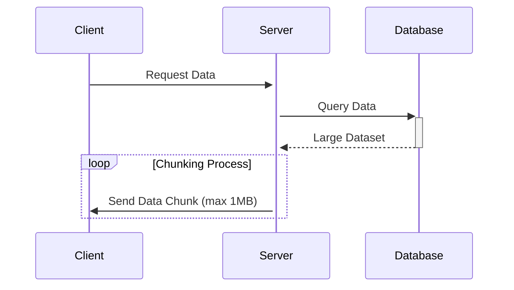
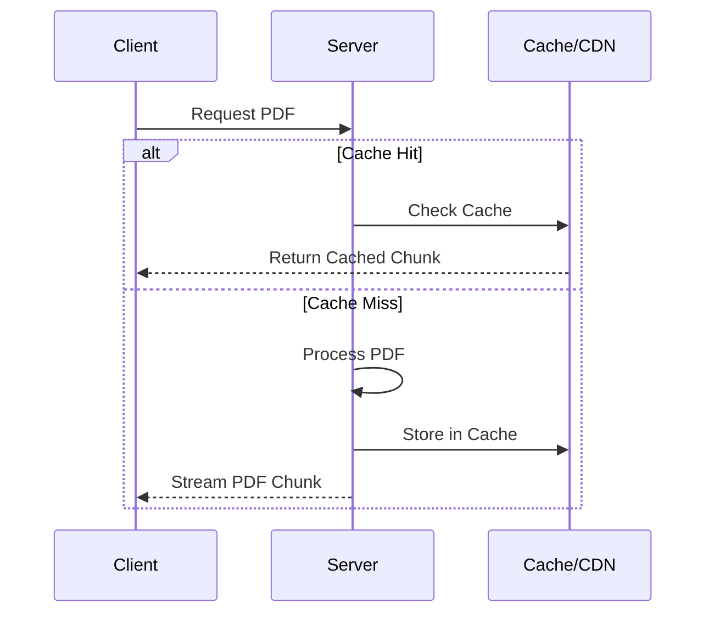
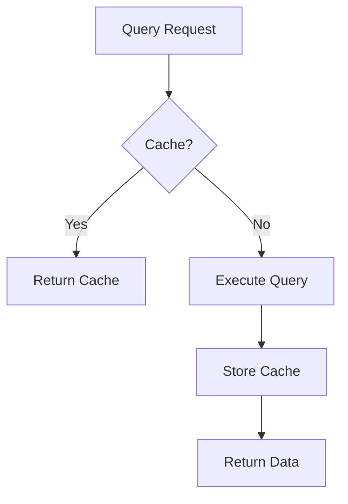
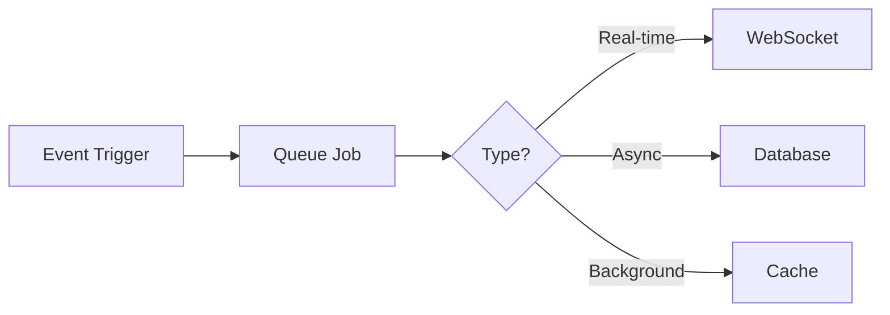
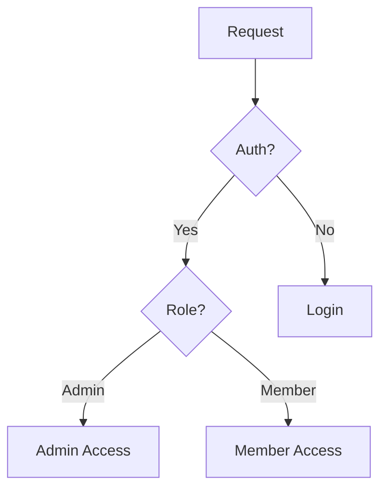

# System Patterns & Optimization Strategies

## 1. API Response Chunking

### Pattern

### Implementasi

1. Pagination default untuk semua list data
2. Streaming response untuk file besar
3. Lazy loading untuk data yang tidak urgent

## 2. PDF Optimization

### Pattern

### Strategi

1. Streaming PDF by chunks
2. Caching PDF segments
3. Progressive loading
4. Compression untuk storage

## 3. Database Query Optimization

### Pattern

### Implementasi

1. Indexing untuk kolom yang sering dicari
2. Eager loading untuk relasi
3. Caching untuk query yang sering diakses
4. Chunking untuk query dengan dataset besar

## 4. Notification System

### Pattern

### Implementasi

1. Queue untuk proses background
2. Batch processing untuk notifikasi massal
3. Caching untuk notifikasi yang sering diakses

## 5. Security Patterns

### Access Control

### File Protection

1. Signed URLs untuk akses file
2. Rate limiting per user
3. Validation untuk semua input
4. Sanitasi output

## 6. Performance Metrics

### Monitoring Points

-   API Response Time
-   Memory Usage
-   Query Execution Time
-   Cache Hit Ratio
-   Error Rates

### Logging Strategy

1. Error logging dengan detail
2. Performance logging untuk optimasi
3. Security logging untuk audit
4. User activity logging
