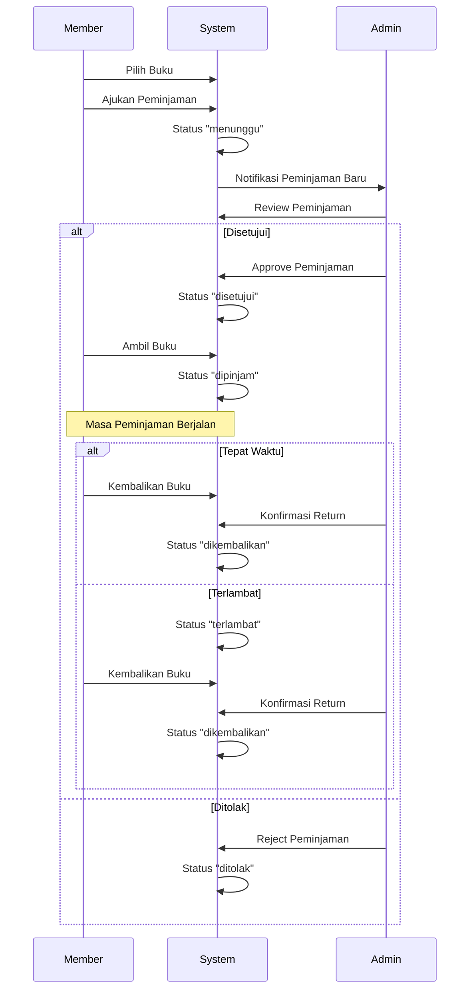

# Pola Sistem (System Patterns)

## Struktur Routing

### Public Routes

```php
// Akses tanpa login
Route::get('/', [HomeController::class, 'index']);
Route::get('/book/{id}', [HomeController::class, 'show']);
Route::get('/book/{id}/read', [BookController::class, 'read']);
Route::get('/book/{id}/pdf', [BookController::class, 'viewPdf']);
```

### Authentication Routes

```php
Route::middleware('guest')->group(function () {
    // Login Routes
    Route::get('/login', [LoginController::class, 'showLoginForm']);
    Route::post('/login', [LoginController::class, 'login']);

    // Register Routes
    Route::get('/register', [RegisterController::class, 'showRegistrationForm']);
    Route::post('/register', [RegisterController::class, 'register']);
});
```

### Member Routes

```php
Route::middleware(['auth', 'role:member'])->group(function () {
    // Dashboard
    Route::get('/member/dashboard', [MemberController::class, 'dashboard']);

    // Peminjaman Management
    Route::get('/peminjaman', [PeminjamanController::class, 'index']);
    Route::get('/peminjaman/{id}', [PeminjamanController::class, 'show']);
    Route::get('/book/pinjam/{id}', [PeminjamanController::class, 'create']);
    Route::post('/book/pinjam', [PeminjamanController::class, 'store']);
});
```

### Admin Routes

```php
Route::middleware(['auth', 'role:admin'])
    ->prefix('admin')
    ->name('admin.')
    ->group(function () {
        // Dashboard
        Route::get('/dashboard', 'dashboard');

        // Resource Routes
        Route::resource('books', AdminBookController::class);
        Route::get('/members', [AdminMemberController::class, 'index']);

        // Peminjaman Management
        Route::get('/peminjaman', [AdminPeminjamanController::class, 'index']);
        Route::post('/peminjaman/{id}/approve', [AdminPeminjamanController::class, 'approve']);
        Route::post('/peminjaman/{id}/reject', [AdminPeminjamanController::class, 'reject']);
        Route::post('/peminjaman/{id}/return', [AdminPeminjamanController::class, 'return']);
    });
```

## Authentication Pattern

### Role-Based Access Control (RBAC)

```php
class CheckRole
{
    public function handle(Request $request, Closure $next, string $role): Response
    {
        if (!$request->user() || $request->user()->role !== $role) {
            return redirect('/');
        }
        return $next($request);
    }
}
```

### Role Types

1. **Guest**

    - Dapat melihat daftar buku
    - Dapat membaca detail buku
    - Dapat melihat PDF buku
    - Dapat register/login

2. **Member**

    - Semua akses guest
    - Dapat mengajukan peminjaman
    - Dapat melihat status peminjaman
    - Dapat melihat history peminjaman

3. **Admin**
    - Manajemen buku (CRUD)
    - Manajemen member
    - Approval peminjaman
    - Konfirmasi pengembalian

## Flow Pattern

### Flow Peminjaman Buku



## Service Pattern

### File Management Service

1. **Upload Pattern**

    - Validasi file (size, type, extension)
    - Generate secure filename
    - Save ke storage
    - Create public symlink

2. **Access Pattern**
    - Validasi existence
    - Security headers
    - Streaming response

### Database Access Pattern

1. **Model Relations**

    ```php
    // Peminjaman -> User
    public function user() {
        return $this->belongsTo(User::class);
    }

    // Peminjaman -> Book
    public function book() {
        return $this->belongsTo(Book::class);
    }

    // Peminjaman -> Admin
    public function approver() {
        return $this->belongsTo(User::class, 'approved_by');
    }
    ```

2. **Query Pattern**
    - Eager loading untuk relasi
    - Pagination untuk list
    - Scoped queries

## Error Handling Pattern

### HTTP Errors

-   404: Resource tidak ditemukan
-   403: Unauthorized access
-   401: Unauthenticated
-   422: Validation error

### Business Logic Errors

1. **Peminjaman**

    - Duplikasi peminjaman
    - Invalid status transition
    - File tidak ditemukan

2. **Upload**
    - Invalid file type
    - File size exceeded
    - Storage error

### Error Response Pattern

```php
return redirect()
    ->back()
    ->with('error', 'Error message here');
```

## Success Response Pattern

```php
return redirect()
    ->route('route.name')
    ->with('success', 'Success message here');
```

## Validation Pattern

### Request Validation

```php
$request->validate([
    'field' => 'validation|rules',
]);
```

### Custom Validation Rules

1. **File Upload**

    - Size limits
    - Allowed types
    - File existence

2. **Peminjaman**
    - Date validation
    - Status transitions
    - Duplicate check

## Security Pattern

### Route Protection

1. **Authentication Check**

    ```php
    Route::middleware('auth')->group(function () {
        // Protected routes
    });
    ```

2. **Role Check**
    ```php
    Route::middleware(['auth', 'role:admin'])->group(function () {
        // Admin only routes
    });
    ```

### File Access Protection

1. **Private Storage**

    - Files stored outside public directory
    - Access through controller only
    - Symlink untuk public access

2. **Download Protection**
    - Secure headers
    - Mime type validation
    - Auth check sebelum download
